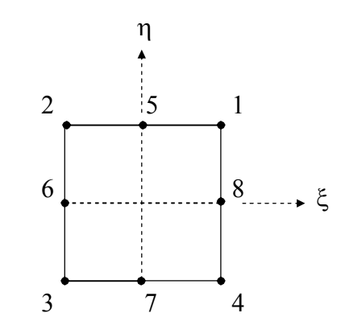
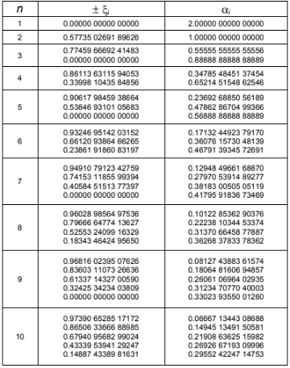

# IMPLEMENTAÇÃO DO ELEMENTO Q8 SERENDIPITY - MEF

> **Resumo (Abstract)**
> O Método dos Elementos Finitos (MEF) é uma ferramenta poderosa para a análise estrutural, mas a sua precisão depende diretamente do tipo de elemento utilizado. A implementação do elemento quadrático de 8 nós da família *Serendipity* (Q8) representa um salto qualitativo significativo em relação aos elementos lineares tradicionais (como o Q4). O elemento Q8 permite uma interpolação quadrática dos deslocamentos sem o custo computacional do nó central interno presente na família de Lagrange. Esta implementação é de extrema importância para a engenharia computacional, pois o Q8 é altamente eficiente em capturar gradientes severos de tensão (como concentrações de tensões ao redor de furos ou entalhes) e ajuda a mitigar problemas numéricos clássicos, como o travamento por cisalhamento (*Shear Locking*). O presente trabalho valida essa superioridade, comprovando que o uso de formulações matemáticas de ordem superior garante maior fidelidade física com malhas consideravelmente menos refinadas.

---

## 1. Código Original e Objetivo do Trabalho

O código original resolvia problemas de estado plano de tensões e deformações utilizando exclusivamente elementos quadriláteros bilineares de 4 nós (Q4). O fluxo geral do programa consistia em: ler a malha a partir de um arquivo de entrada (nós, conectividades, materiais, condições de contorno e forças aplicadas), montar a matriz de rigidez global, aplicar as restrições, resolver o sistema linear e exportar os resultados em formato VTK para visualização avançada no software ParaView.

O **objetivo principal** deste trabalho foi expandir a capacidade do solucionador implementando um elemento de ordem superior: o **Q8 Serendipity**. Em seguida, realizou-se um estudo comparativo de precisão e convergência entre os elementos Q4 e Q8, utilizando como base o problema clássico da mecânica da fratura: a placa tracionada com furo central.

---

## 2. O Que Foi Adicionado

### 2.1 O Elemento Q8 (Formulação e Funções de Forma)

O elemento Q8 possui 8 nós em sua topologia: os 4 nós dos vértices (já presentes no Q4) mais um nó localizado no ponto médio de cada uma das 4 arestas. Cada nó possui 2 graus de liberdade (deslocamentos nas direções X e Y), totalizando **16 graus de liberdade (GDL) por elemento**. Essa diferença reflete diretamente na estrutura geométrica e matemática do código, onde a matriz de rigidez elementar ($K_e$) passa a ter dimensões de $16 \times 16$, contrapondo a matriz $8 \times 8$ do Q4.

Para que a formulação matemática interpole os deslocamentos corretamente, as funções de forma (escritas no sistema de coordenadas naturais $\xi$ e $\eta$) são definidas da seguinte maneira:

**Funções de forma para os nós no meio das arestas:**
$$\begin{aligned}
N_5 &= \frac{1}{2}(1 + \eta)(1 + \xi)(1 - \xi) \\
N_6 &= \frac{1}{2}(1 - \xi)(1 + \eta)(1 - \eta) \\
N_7 &= \frac{1}{2}(1 - \eta)(1 + \xi)(1 - \xi) \\
N_8 &= \frac{1}{2}(1 + \xi)(1 + \eta)(1 - \eta)
\end{aligned}$$

**Funções de forma para os nós dos cantos:**
$$\begin{aligned}
N_1 &= \frac{1}{4}(1 + \xi)(1 + \eta) - \frac{1}{2}(N_5 + N_8) \\
N_2 &= \frac{1}{4}(1 - \xi)(1 + \eta) - \frac{1}{2}(N_5 + N_6) \\
N_3 &= \frac{1}{4}(1 - \xi)(1 - \eta) - \frac{1}{2}(N_6 + N_7) \\
N_4 &= \frac{1}{4}(1 + \xi)(1 - \eta) - \frac{1}{2}(N_7 + N_8)
\end{aligned}$$

### 2.2 Derivadas Parciais e a Matriz Cinemática

No Método dos Elementos Finitos, calcular apenas o deslocamento não é suficiente. Para a engenharia, a variável de maior interesse costuma ser a **tensão**, que é derivada diretamente da deformação do material ($\varepsilon$). Pela teoria da elasticidade, as deformações são, por definição, as **derivadas espaciais dos deslocamentos**.

**Por que derivar parcialmente?**
Para calcularmos a matriz cinemática ($B$), que relaciona matematicamente os deslocamentos nodais com as deformações no interior do elemento, precisamos derivar as funções de forma. Contudo, as nossas funções estão descritas num domínio natural padronizado ($r, s$ equivalentes a $\xi, \eta$). Para trazer essas derivadas para o mundo geométrico real ($x, y$), utilizamos a operação do **Mapeamento Isoparamétrico** através da Matriz Jacobiana ($J$).

**Como isso foi implementado?**
A implementação exigiu o cálculo analítico prévio ("na mão") das derivadas parciais de cada uma das 8 funções de forma em relação a $r$ e $s$. Esses resultados foram codificados nas matrizes `dhdr` e `dhds` do script Python. Abaixo estão as formulações matemáticas exatas que alimentam o nosso algoritmo:

**Derivadas parciais das funções de forma em relação a $r$ (`dhdr`):**
$$\begin{aligned}
\frac{\partial N_1}{\partial r} &= \frac{1}{4}(1 - s)(2r + s) \\
\frac{\partial N_2}{\partial r} &= \frac{1}{4}(1 - s)(2r - s) \\
\frac{\partial N_3}{\partial r} &= \frac{1}{4}(1 + s)(2r + s) \\
\frac{\partial N_4}{\partial r} &= \frac{1}{4}(1 + s)(2r - s) \\
\frac{\partial N_5}{\partial r} &= -r(1 - s) \\
\frac{\partial N_6}{\partial r} &= \frac{1}{2}(1 - s^2) \\
\frac{\partial N_7}{\partial r} &= -r(1 + s) \\
\frac{\partial N_8}{\partial r} &= -\frac{1}{2}(1 - s^2)
\end{aligned}$$

**Derivadas parciais das funções de forma em relação a $s$ (`dhds`):**
$$\begin{aligned}
\frac{\partial N_1}{\partial s} &= \frac{1}{4}(1 - r)(2s + r) \\
\frac{\partial N_2}{\partial s} &= \frac{1}{4}(1 + r)(2s - r) \\
\frac{\partial N_3}{\partial s} &= \frac{1}{4}(1 + r)(2s + r) \\
\frac{\partial N_4}{\partial s} &= \frac{1}{4}(1 - r)(2s - r) \\
\frac{\partial N_5}{\partial s} &= -\frac{1}{2}(1 - r^2) \\
\frac{\partial N_6}{\partial s} &= -s(1 + r) \\
\frac{\partial N_7}{\partial s} &= \frac{1}{2}(1 - r^2) \\
\frac{\partial N_8}{\partial s} &= -s(1 - r)
\end{aligned}$$

### 2.3 A Integração Numérica (Quadratura de Gauss-Legendre)

A equação fundamental para obter a Matriz de Rigidez ($K_e$) é resolvida integrando-se o volume do elemento. Em uma dimensão, a Quadratura de Gauss aproxima a integral de uma função entre -1 e 1 através de um somatório ponderado em pontos específicos:
$$\int_{-1}^{1} f(x) \, dx \approx \sum_{i=1}^{n} w_i f(x_i)$$

Aplicando isso para a formulação 2D, a integral dupla em relação às coordenadas naturais se transforma no seguinte somatório:
$$K_e = \int_{-1}^{1} \int_{-1}^{1} B^T D B \det(J) t \, dr \, ds \approx \sum_{i=1}^{n} \sum_{j=1}^{n} w_i w_j \left( B^T D B \det(J) t \right)\Big|_{r_i, s_j}$$
Onde $n$ é o número de pontos de integração, $r_i$ e $s_j$ são as coordenadas dos pontos (as raízes do polinômio de Legendre), e $w_i$ e $w_j$ são os respectivos pesos da função nesses pontos.

**Por que nós a utilizamos?**
1. **A Impossibilidade da Integração Analítica:** As funções de forma do Q8 são quadráticas. Ao multiplicar $B^T \cdot D \cdot B$, eleva-se o grau do polinômio consideravelmente. Se o elemento Q8 for geometricamente distorcido (não for um retângulo perfeito), o determinante do Jacobiano $\det(J)$ deixa de ser constante e passa a ser uma função de $r$ e $s$. Isso transforma a expressão inteira em um quociente de polinômios super complexo, tornando a integração analítica computacionalmente inviável.
2. **A "Mágica" da Exatidão Numérica:** Gauss resolve a equação pesada avaliando a função em pouquíssimos pontos estratégicos. Uma quadratura com $n$ pontos consegue integrar perfeitamente qualquer polinômio de grau até $2n-1$.
3. **Esquema $3 \times 3$ no Q8:** O elemento Q4 usa integração $2 \times 2$ (4 pontos). No entanto, as funções quadráticas do Q8 exigem uma quadratura mais rica. Usamos um esquema de 3 pontos na horizontal e 3 na vertical (totalizando 9 pontos). Isso garante exatidão nos termos principais da matriz e previne o *Hourglassing* (modos de energia nula que causariam instabilidade na malha).

**A Implementação no Código:**
O algoritmo Python traduz o somatório da fórmula exatamente da seguinte forma:
* **Definição de Pontos e Pesos:** Inserimos as raízes tabeladas por Legendre. 
  `pts = [-np.sqrt(0.6), 0.0, np.sqrt(0.6)]` (representando $r_i$ e $s_j$).
  `wts = [5.0/9.0, 8.0/9.0, 5.0/9.0]` (representando os pesos $w_i$ e $w_j$).

* **Laço Duplo de Somatório:** Criou-se repetições variando sobre os pontos: `for i in range(3):` e `for j in range(3):`.
* **Cálculo Isolado e Acúmulo:** Dentro do laço, o peso combinado (`weight = wts[i] * wts[j]`) é gerado. A matriz $B$ e o $\det(J)$ são calculados especificamente para aquele par $(r, s)$. Por fim, a integral é acumulada: `Ke += B.T @ D @ B * detJ * thic * weight`.

### 2.4 O Cálculo de Tensões e Pós-Processamento

Como mencionado, comparar Q4 e Q8 usando apenas o mapa de deslocamentos é inconclusivo, pois a verdadeira vantagem da ordem superior revela-se na suavidade e precisão das derivadas do deslocamento (as tensões). 

Para suportar essa análise, foi desenvolvida uma rotina completa de recuperação de tensões. O algoritmo lê o campo de deslocamentos, interpola as tensões dentro do elemento e, crucialmente, realiza uma **suavização (Média Nodal)** entre os elementos vizinhos que compartilham o mesmo nó. O campo resultante (Tensões normais, cisalhantes e Tensão Equivalente de Von Mises) passou a ser injetado e exportado no arquivo VTK para renderização no ParaView.

Ademais, o *solver* iterativo original do código foi substituído por um **solver direto**. Essa melhoria arquitetural aumentou a robustez da ferramenta, contornando problemas de mau condicionamento numérico da matriz global causados pela imposição de condições de contorno via método da penalidade.

---
## 3. Como Compilar e Rodar

O programa foi desenvolvido em Python e não necessita de compilação prévia, apenas interpretação. Para rodar o projeto, siga o passo a passo:

1. **Pré-requisitos:** Certifique-se de ter o Python 3.x instalado em sua máquina, juntamente com as bibliotecas `numpy` e `pandas` (podem ser instaladas via `pip install numpy pandas`).
2. **Arquivos de Entrada:** Coloque a planilha Excel de configuração da malha (ex: `furo_Q8.xlsx`) dentro do diretório apropriado (pasta `exemplos`).
3. **Execução:** Abra o terminal (ou prompt de comando) na pasta `src` onde está o código fonte e execute o script principal com o comando:
   `python mef_completo.py`
4. **Resultados:** O programa fará a leitura da planilha, resolverá a matriz de rigidez e gerará um arquivo de saída com a extensão `.vtk`.
5. **Visualização:** Abra o software **ParaView**, importe o arquivo `.vtk` gerado e aplique os filtros de visualização para analisar os campos de tensões e deslocamentos.
---

## 4. Validação dos Resultados

A etapa de validação adotou como referência o clássico **Problema de Kirsch**: uma placa infinita sob tração uniaxial contendo um furo circular. Analiticamente, a borda do furo age como um amplificador de esforços, gerando um pico de tensão estritamente igual a três vezes o valor da tensão aplicada longe do defeito. Ou seja, o fator teórico de concentração de tensão ($K_t$) vale 3.

* **O Modelo:** Tirando proveito da simetria, apenas 1/4 da placa foi modelado, com o furo sendo pequeno em relação à dimensão externa para mimetizar o comportamento de uma chapa infinita.
* **O Teste:** Aplicou-se uma tensão nominal controlada equivalente a 100 kPa tracionando a extremidade. A física prescreve que o elemento mais próximo da raiz do furo deveria acusar uma resposta de aproximadamente 300 kPa.
* **O Resultado:** O algoritmo acusou uma tensão máxima de pico correspondente a um $K_t = 3.009$, provando a alta integridade matemática da rotina desenvolvida.

---

## 5. Estudo Comparativo: Q4 vs. Q8

Através do refinamento progressivo da malha em ambos os elementos simulando a mesma geometria com furo, conclusões cruciais foram extraídas:

* **Desempenho em Gradientes Complexos:** O Q8 é categoricamente superior em regiões com forte variação de tensão. Devido aos nós localizados no meio das arestas, ele é capaz de descrever curvaturas físicas (borda do furo) com muito mais fidelidade geométrica, além de possuir um campo interno de deslocamentos não-lineares adequado para capturar a resposta física sem artifícios sintéticos.
* **Convergência Computacional:** O Q8 atingiu o resultado assintótico de $K_t \approx 3$ com pouquíssimos elementos e graus de liberdade. Em contrapartida, para o Q4 atingir uma fidelidade sequer parecida, precisou de uma malha maciçamente mais densa e refinada no entorno do furo, retardando o processo de convergência.
* **Custos e Benefícios:** É importante ressaltar que para problemas de campo de tensão uniforme (sem gradientes abruptos, como num simples teste de tração de placa lisa), as vantagens da interpolação de ordem superior desaparecem. Nesses casos limitados, Q4 e Q8 forneceriam exatidões idênticas, fazendo do Q4 a escolha otimizada por requerer menos memória e poder de processamento computacional.
---

## 6. Referências

1. ZIENKIEWICZ, O. C.; TAYLOR, R. L.; ZHU, J. Z. *The Finite Element Method: Its Basis and Fundamentals*. 7ª ed. Butterworth-Heinemann, 2013.
2. RIBEIRO, F. L. B. *Introdução ao Método dos Elementos Finitos*. Notas de Aula. COPPE / UFRJ – Programa de Engenharia Civil.